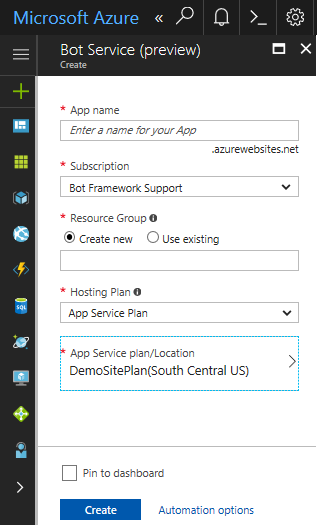
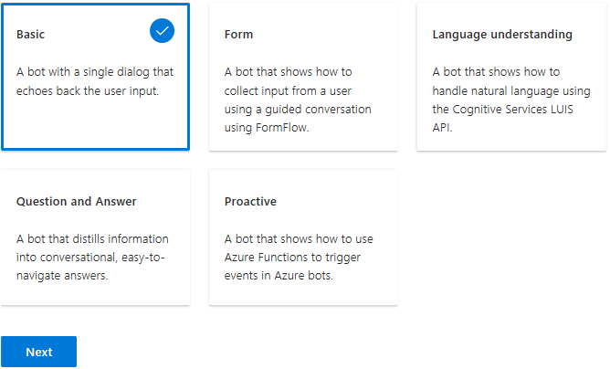
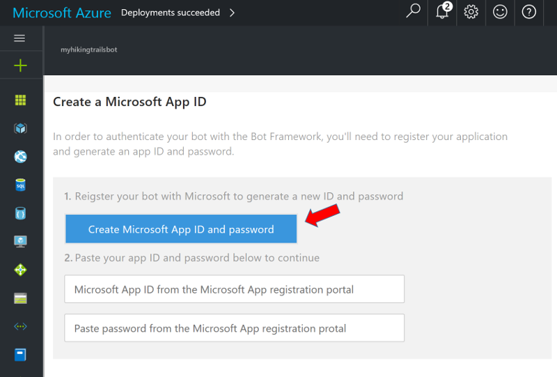
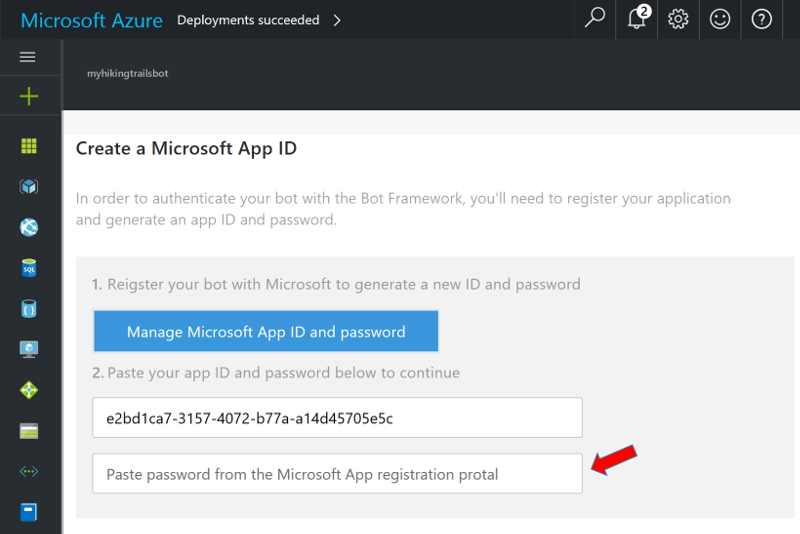
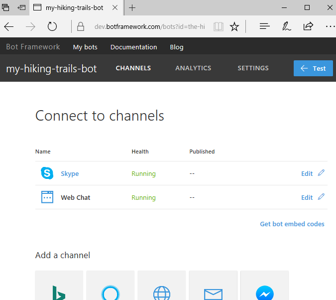
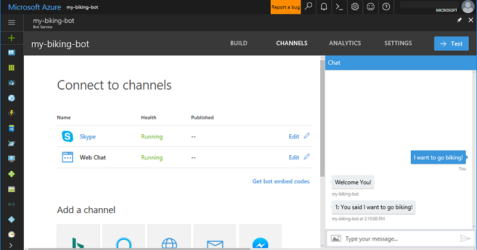

## Create a Bot with the Azure Bot Service

The Azure Bot Service accelerates the process of developing a bot by provisioning a web host with one of five bot templates you can modify in an integrated environment that is purpose-built for bot development.

### Create a New Bot Service

To get started, we will create an instance of the bot service.

1. Navigate to the [Azure Portal](https://portal.azure.com).

1. Select **New** in the menu blade.

1. In the **New** blade, navigate to the **Data + Analytics** category, and select **Bot Service**.

1. In the Bot Service blade, provide the following requested information:

    - Set **App name** to your bot’s name. The name is used as the subdomain when your bot is deployed to the cloud (for example, *mybasicbot*.azurewebsites.net).

    - Select the subscription to use.

    - Select the [resource group](https://azure.microsoft.com/en-us/documentation/articles/resource-group-overview/), [hosting plan](azure-bot-service-hosting-plan.md), and [location](https://azure.microsoft.com/en-us/regions/).  

    

1. Click **Create** to create the bot service and deploy it to the cloud.

1. Confirm that the bot service has been deployed.

    - Click **Notifications** (the bell icon that is located along the top edge of the Azure portal). The notification will change from **Deployment started** to **Deployment succeeded**.

    - After the notification changes to **Deployment succeeded**, click **Go to resource** on that notification.

	

### Create a New Bot

Now that our bot service is ready, we can create a bot using the service.

1. On the **Bot Service** blade, choose the programming language that you want to use to develop your bot. For this tutorial, choose the **C#** language.

	  

1. Select the template to use as the starting point for developing your bot. For this tutorial, choose the **Basic** template.

	  

1. Click **Next** to create the bot based on the programming language and template that you've chosen.

### Create Bot App ID and password  

We will need to create authentication credentials for our new bot.

1. Create an app ID and password for your bot, so that it will be able to authenticate with the Bot Framework.

1. Click **Create Microsoft App ID and password**.  

      

1. On the page that opens in a new browser tab, click **Generate an app password to continue**.

1. Copy and securely store the password that is shown, and then click **Ok**.

1. Click **Finish and go back to Bot Framework**.

1. Back in the Azure Portal, assure the **app ID** field is auto-populated for you, and paste the password that you copied (in step 3 above) into the password field.

	> If the **app ID** field is not auto-populated, you can retrieve it by signing in to the [Microsoft Application Registration Portal](https://apps.dev.microsoft.com) and copying the application ID from your application's registration settings.

      

1. Agree to terms, and then click **Create bot**.

	> When you click **Create bot**, there may be a slight delay before a splash screen renders to indicate that the bot service is generating your bot. *Do not* click **Create bot** again. Please wait for the splash screen to appear.

1. When the bot service finishes generating your bot, the Azure editor will contain the bot's source files. At this point, the bot has been created, registered with the Bot Framework, deployed to the cloud, and is fully functional.

1. If you sign in to the [Bot Framework Portal](https://dev.botframework.com), you'll see that your bot is now listed under **My bots**. Congratulations! You've successfully created a bot by using the Azure Bot Service!

	

### Test Your New Bot

Now that your bot is running in the cloud, try it out by typing a few messages into the built-in chat control
that's located to the right of the code editor in Azure.
You should see that the bot responds to each message you send by echoing back your message prefixed with the text *You said*.

  

> **Up Next**: [Create your first LUIS app](luis.html)
