## Create your first LUIS App

Language Understanding Intelligent Service (LUIS) allows your application to understand what a person wants in their own words. LUIS uses machine learning to allow developers to build applications that can receive user input in natural language and extract meaning from it. A client application that converses with the user can pass user input to a LUIS app and receive relevant, detailed information back.

### Create a Cognitive Services APIs account

To use Microsoft Cognitive Service APIs, you first need to create an account in the Azure portal.

1. Navigate to the [Azure Portal](https://portal.azure.com).

1. Click **+ NEW**.

1. Select **AI + Cognitive Services** and discover the list of availble APIs. Click on **See all** to see the entire list of Cognitive Services APIs. Click on the API of your choice to proceed.

	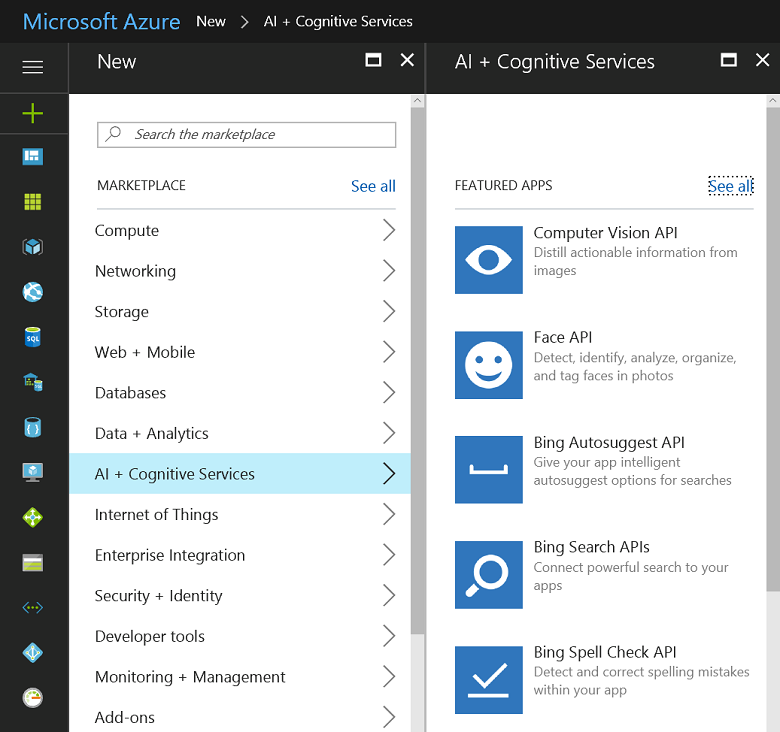

1. On the **Create** page, provide the following information:

	- **Account Name:** Name of the account. We recommend using a descriptive name, for example *AFaceAPIAccount*.

	- **Subscription:** Select one of the available Azure subscriptions in which you have at least Contributor permissions.

	- **API Type:** Choose the Cognitive Services API you want to use. For this exercise, we will select the **Language Understanding Intelligent Service (LUIS)** option.

	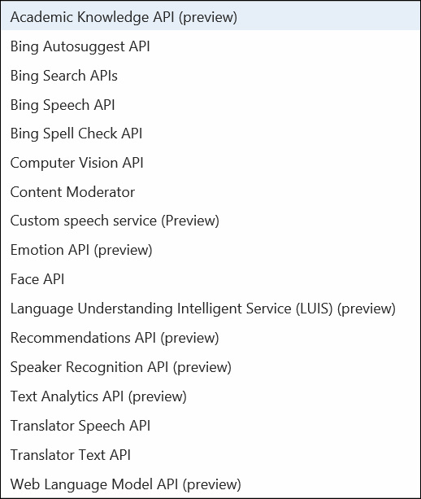

	- **Pricing tier:** The cost of your Cognitive Services account depends on the actual usage and the options you choose. For more information about pricing for each API, please refer to the [pricing pages](https://azure.microsoft.com/pricing/details/cognitive-services/).

	- **Resource Group:** Create a new resource group named **CapitalOneWITCognitive**.

	- **Resource Group Location:** This is required only if the API selected is global (not bound to a location). If the API is global and not bound to a location, however, you must specify a location for the resource group where the metadata associated with the Cognitive Services API account will reside. This location will have no impact on the runtime availability of your account. To learn more about resource group, please refer to [Manage Azure resources through portal](https://docs.microsoft.com/azure/azure-resource-manager/resource-group-portal).

	- **Explicit acknowledgment of Online Service Terms:** In order to create an account, subscription Owners or Contributors (as defined by [Azure Role-Based Access Control](https://docs.microsoft.com/azure/active-directory/role-based-access-control-what-is)) need to explicitly acknowledge the terms that apply to Cognitive Services in [Online Service Terms](https://www.microsoft.com/en-us/Licensing/product-licensing/products.aspx).

1. To pin the account to the Azure portal dashboard, click **Pin to Dashboard**.

1. Click **Create** to create the account.

1. After the Cognitive Services account is successfully deployed, click the tile in the dashboard to view the account information.

1. Record the value of the **Endpoint URL** in the **Overview** section and keys in the **Keys** section to use when you start making API calls in your applications.

	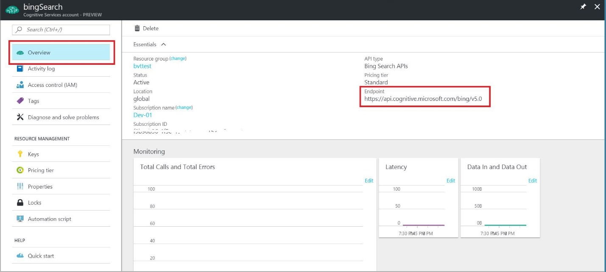

	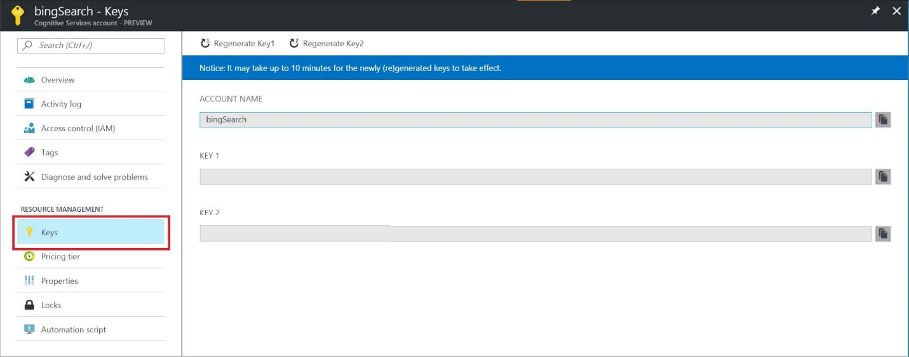

### Create a LUIS.ai account

For this hands-on exercise, you will also need a **LUIS.ai** account.

1. In your browser, navigate to <https://www.luis.ai/>.

1. Click the **Sign in our create an account** button.

1. Authorize the **Luis.ai** application to access your account details.

1. Once your account is created, you will be taken to a simple signup form. Fill out the form with your **Country**, **Company** and **Referral** information.

1. Click the **Continue** button.

1. You will now arrive at the LUIS **My Apps** page.

### Create a new LUIS app

You can create and manage your applications on My Apps page. You can always access this page by clicking My Apps on the top navigation bar of LUIS web page.

1. If you are not already there, navigate to the **My Apps** page on the **Luis.ai** website and login: <https://www.luis.ai/applications>.

1. On **My Apps** page, click **New App**.

1. In the dialog box, name your application "Home Automation".

	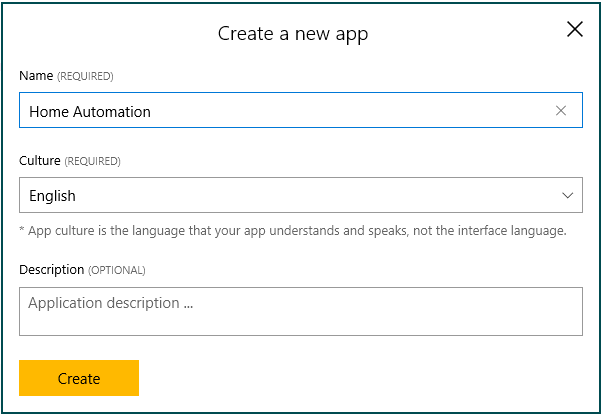

1. Choose your application culture (for this Home Automation app, we’ll choose English), and then click **Create**.

    > The culture cannot be changed once the application is created.

1. LUIS creates the Home Automation app and opens to the Dashboard. The application dashboard contains summary information about app usage.

1. You can explore your application using the links in the left panel.

	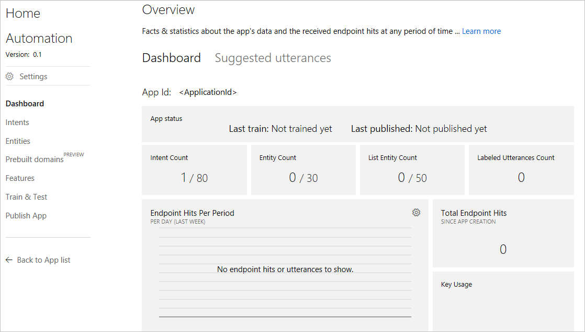

1. Click on **Prebuilt domains** in the left-side navigation pane. Then click on **HomeAutomation**.

	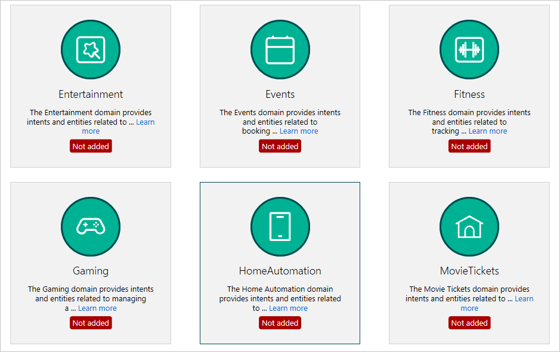

1. Click **Yes** when prompted to add the **"HomeAutomation"** domain to the app.

	

1. Click on **Intents** in the left-side navigation pane, and you can see that the HomeAutomation domain provides **HomeAutomation.TurnOff**, **HomeAutomation.TurnOn**, and **None** intents in your application. Each intent has sample utterances.

	> **None** is an intent provided by all LUIS apps. You use it to handle utterances that don't correspond to functionality your app provides.

	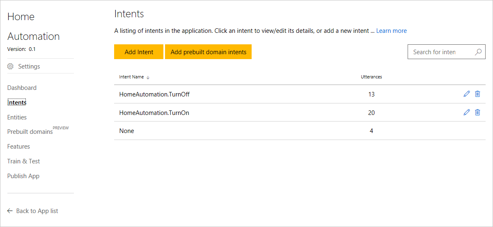

1. Click on the **HomeAutomation.TurnOff** intent. You can see that the intent contains a list of utterances which are labeled with entities.

	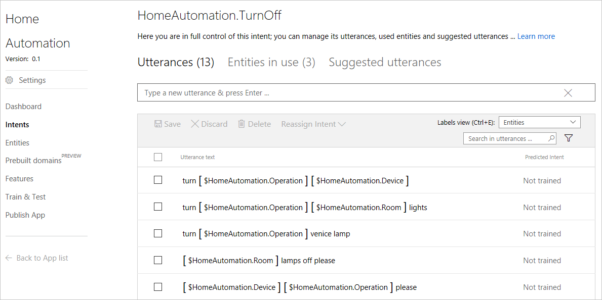

1. Click on the **Labels view** and select **tokens**. This shows the text tokens that make up each labeled entity, instead of the name of the entity type.

1. If you compare the same utterance in the tokens view and the entities view, you can see that some of the words of each utterance have already been labeled.

1. The first utterance is "turn off staircase." The word "off" has been labeled as the type of HomeAutomation.Operation. The word "staircase" has been labeled as the type of "HomeAutomation.Device."

	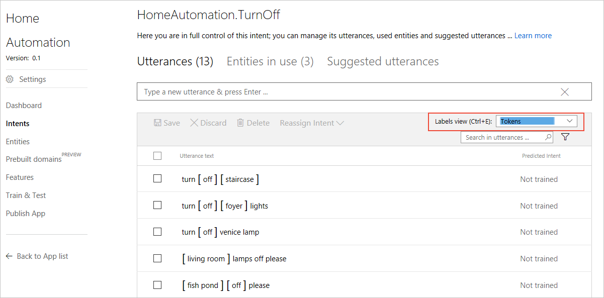

1. Click **Entities in use**. This shows the entities this app identifies in the utterances.

	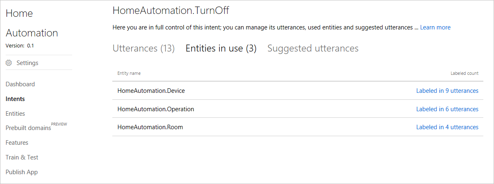


## Train & Test your LUIS App

To validate our app, we should train it. Once we've trained the app, you can test it immediately. We can then publish our app and test the published endpoint in a browser using the generated URL.

1. Click on **Train & Test** in the left-side navigation, then click **Train application**.

	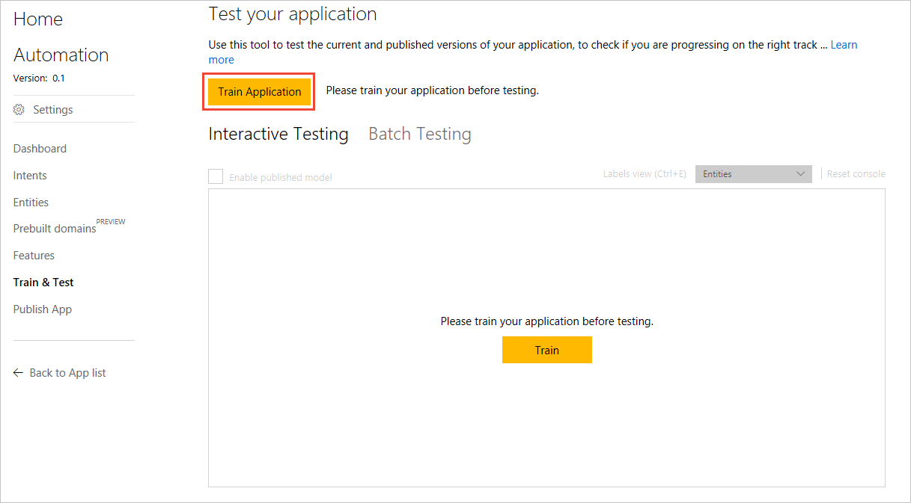

1. Type a test utterance like "Turn off the lights" into the Interactive Testing pane, and press Enter.

	```
	Turn off the lights
	```

1. The results display the score associated with each intent. Check that the top scoring intent corresponds to the intent you expected for each test utterance.

1. In this example, "Turn off the lights" is correctly identified as the top scoring intent of "HomeAutomation.TurnOff."

	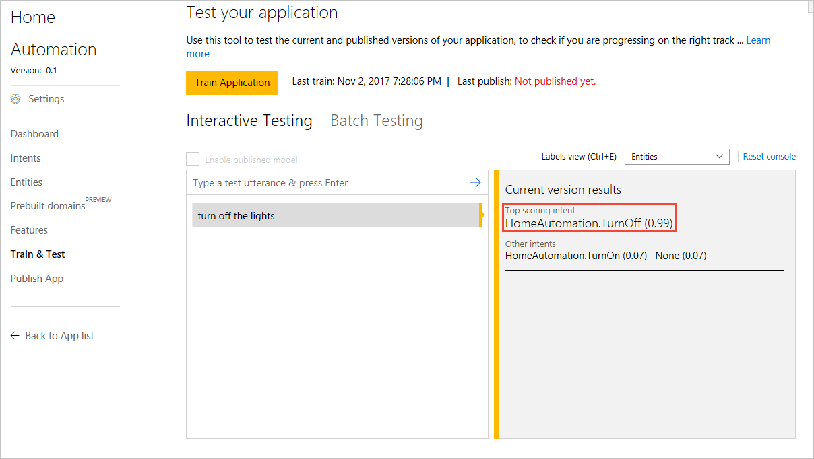

1. Select **Publish App** from the left-side menu and click the **Publish** button.

	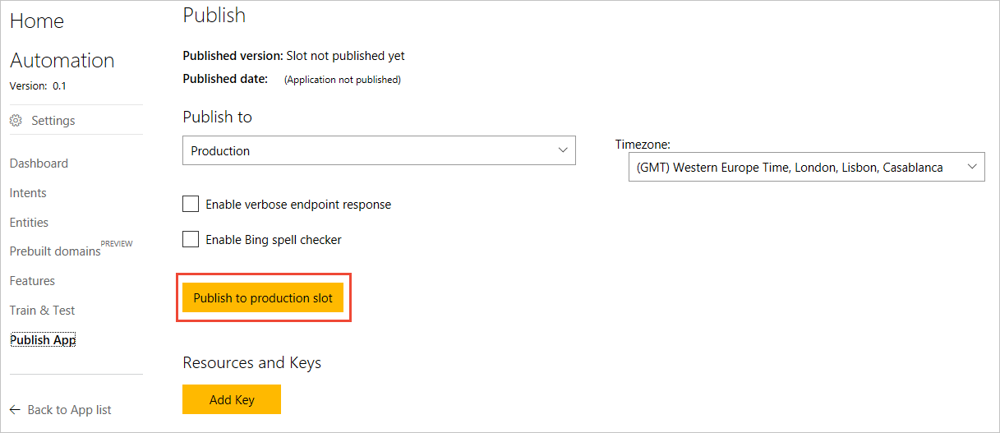

1. After you've successfully published, you can use the Endpoint URL that the **Publish App** page displays.

	

1. Copy the URL, then replace the `{YOUR-KEY-HERE}` with one of the keys listed in the **Key String** column for the resource you want to use. To open this URL in your browser, set the URL parameter "&q" to your test query. For example, append `&q=turn off the living room light` to your URL, and then press Enter. The browser displays the JSON response of your HTTP endpoint.  

	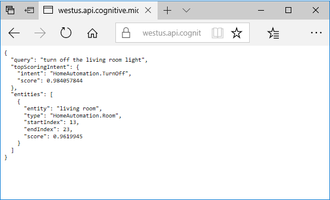

> **Up Next**: [Create a QNA Maker Service](qna.html)
