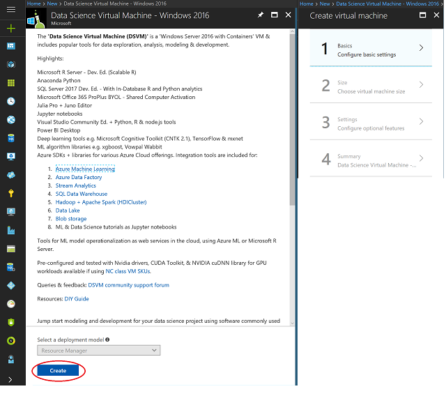

## Installation and Setup

Prior to starting today’s hands-on exercises, we must first configure our environment. Today, we will take advantage of the [Data Science Virtual Machine](https://azuremarketplace.microsoft.com/en-us/marketplace/apps/microsoft-ads.windows-data-science-vm?tab=Overview).

### Obtain a Microsoft Account

We must obtain a Microsoft Account that we will use with our new Azure subscription. If you already have a Microsoft Account, you can skip this section.

1. In your browser, navigate to <https://account.microsoft.com/account>.

1. Click the **Sign In With Microsoft** button.

1. In the sign-in form, locate and click the **No account? Create one!** link.

1. If you already have an e-mail address, you can use your existing e-mail address with the signup form. If you do not have an e-mail address (or you wish to use an anonymous e-mail), you can click the **Get a new e-mail address** link.

    > You may need to verify your identity using an automated SMS message.

1. Once the signup form is completed, you will have a new Microsoft Account associated with a new or existing e-mail address.

### Create a new Azure Subscription

The Azure free account offers $200 in credit to use on any Azure products for 30 days.

1. In your browser, navigate to <https://azure.microsoft.com/en-us/free/>.

1. Click the **Start free** button.

1. Complete the account signup form. You will be prompted to verify your identity using both a valid credit card and SMS message.

    > Your credit card information is used for identity verification, but you will not be charged until you choose to upgrade.

### Create a new Data Science Virtual Machine

The Microsoft Data Science Virtual Machine is a Windows Azure virtual machine (VM) image pre-installed and configured with several popular tools that are commonly used for data analytics and machine learning. We will use the **Data Science Virtual Machine** for the remaining exercises today.

1. Navigate to the virtual machine listing on the [Azure Portal](https://portal.azure.com/#create/microsoft-ads.windows-data-science-vmwindows2016).

1. Select the **Create** button at the bottom to be taken into a wizard.

    

1. The wizard used to create the Microsoft Data Science Virtual Machine requires **inputs** for each of the **four steps** enumerated on the right of this figure. Here are the inputs needed to configure each of these steps:

    a. **Basics**

        - **Name**: Name of your data science server you are creating.

        - **VM Disk Type**: Select the **SSD** option.

        - **User Name**: Admin account login id.

        - **Password**: Admin account password.

        - **Subscription**: If you have more than one subscription, select the one on which the machine is to be created and billed.

        - **Resource Group**: You can create a new one or use an existing group.

        - **Location**: Select the data center that is most appropriate. Usually it is the data center that has most of your data or is closest to your physical location for fastest network access.

    b. **Size**: Select the **DS3_V2 (4 vCPUs, 14 GB)** size option.

    c. **Settings**:

        - **Use Managed Disks**: Choose **Managed** to let Azure manage the disks for the VM.

    d. **Summary**: Verify that all information you entered is correct and click **Create**.

        > The provisioning should take about 10-20 minutes. The status of the provisioning is displayed on the Azure portal.

1. Once the VM is created, you can remote desktop into it using the Admin account credentials that you configured in the preceding **Basics** section.

> **Up Next**: [Create a bot with the Azure Bot Service](bot.html)
